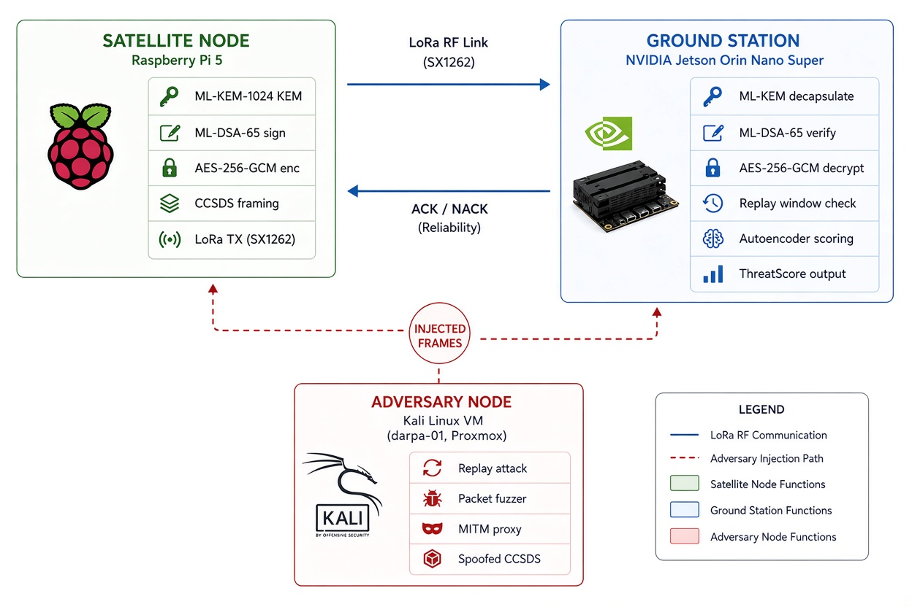

# AegisLEO — System Architecture

## Overview

AegisLEO is a hardware-in-the-loop testbed that simulates a satellite telemetry downlink with post-quantum cryptographic protection and ML-based anomaly detection. The system comprises three physical nodes and one adversary node, connected over a real RF link.



---

## Node Roles

### Satellite Node — Raspberry Pi 5
Generates synthetic telemetry, performs ML-KEM encapsulation for session establishment, signs packet cores with ML-DSA-65, encrypts with AES-256-GCM, applies CCSDS-inspired framing and chunking, and transmits over LoRa.

Primary code: `satellite/transmitter.py`, `crypto/`

### Ground Station — NVIDIA Jetson Orin Nano Super
Receives and reassembles chunks, verifies signatures, decrypts, checks the replay window, scores telemetry with the sequence autoencoder, computes a composite ThreatScore, and returns ACK/NACK.

Primary code: `groundstation/receiver.py`, `groundstation/reassembly.py`, `models/runtime_detector.py`

### Adversary Node — Kali Linux VM
Injects forged, replayed, or anomalous frames to exercise both the cryptographic and behavioral detection layers under post-breach conditions. The adversary does not possess the satellite’s ML-DSA private key.

Primary code: `adversary/kali-inj-bridge.py` and related tools

---

## End-to-End Data Flow

---

## Data Flow

```
[Telemetry sample]
       │
       ▼
[ML-KEM-1024 session key exchange]  ← one-time per session
       │
       ▼
[ML-DSA-65 sign packet core]
       │
       ▼
[AES-256-GCM encrypt with session key]
       │
       ▼
[CCSDS Space Packet framing]
       │
       ▼
[Chunk + byte-stuff for LoRa MTU]
       │
    LoRa RF
       │
       ▼
[Reassemble chunks]
       │
       ▼
[Verify ML-DSA-65 signature]  ── FAIL ──▶ ThreatScore = 1.0, NACK
       │ PASS
       ▼
[AES-256-GCM decrypt]
       │
       ▼
[Replay window check]  ── REPLAY ──▶ ThreatScore += 0.1
       │ FRESH
       ▼
[Autoencoder anomaly score]
       │
       ▼
[Composite ThreatScore]
  crypto_verdict × 0.6
  + ml_score     × 0.3
  + replay_flag  × 0.1
       │
       ▼
[ACK / NACK → satellite]
```

---

## Transport Framing

Logical packets are chunked to fit the LoRa DTU and wrapped in a byte-stuffed frame:

```
FRAME_START (0x7E)
STUFFED_LENGTH (4 bytes, big-endian, byte-stuffed)
PAYLOAD (JSON chunk)
FRAME_END (0x7F)
```

Byte-stuffing ensures `0x7E`, `0x7F`, and `0x7D` never appear raw in the length field, preventing framing misalignment on a noisy RF link.

---

## Design Principles

- Cryptographic verification and behavioral anomaly detection are independent layers.
- All security-relevant constants and key material are kept out of version control.
- The testbed prioritizes measurability and adversarial realism over production polish.
- Hardware choices (Pi 5 + Jetson Orin + SX1262) were selected to force confrontation with real resource and RF constraints.
## v2.0 Planned Changes

- Replace SX1262 LoRa with HackRF One (TX) + RTL-SDR v4 (RX) for true over-the-air testing
- GNU Radio channel model (Doppler, AWGN)
- InfluxDB + Grafana for live ThreatScore dashboards
- Hailo-10H for on-board ML acceleration

---
