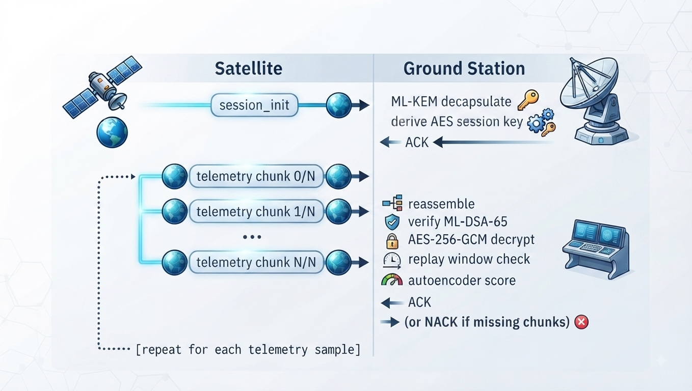

# AegisLEO — Protocol Specification

## Overview

AegisLEO uses a two-phase protocol over a unidirectional LoRa RF link: a session establishment phase (key exchange) followed by a telemetry streaming phase. Both phases use the same transport framing layer. The ground station sends ACK/NACK responses back to the satellite over the same LoRa link.

---

## Transport Framing

All data — in both directions — is wrapped in a byte-stuffed transport frame.

```
┌────────────┬───────────────────────────┬─────────────┬──────────┐
│ FRAME_START│ STUFFED_LENGTH (4 bytes)  │ PAYLOAD     │ FRAME_END│
│ 0x7E       │ big-endian, byte-stuffed  │ (JSON, UTF8)│ 0x7F     │
└────────────┴───────────────────────────┴─────────────┴──────────┘
```

**Byte-stuffing:** The length field is byte-stuffed so `0x7E`, `0x7F`, and `0x7D` never appear raw inside it. Escape byte is `0x7D`; stuffed byte is `original XOR 0x20`.

**MTU:** LoRa DTU limit is ~240 bytes wire size. Large logical packets are chunked before framing.

---

## Packet Types

### 1. Session Init (`session_init`)

Sent by the satellite at the start of each session to perform ML-KEM key exchange.

```json
{
  "type": "session_init",
  "spacecraft_id": "AegisLEO-SAT-1",
  "session_id": "<16-char hex>",
  "kem_ciphertext": "<base64>",
  "satellite_public_key": "<base64 ML-DSA-65 public key>",
  "timestamp_tai": "<float>"
}
```

The ground station decapsulates `kem_ciphertext` with its ML-KEM private key to recover the shared secret, then derives the AES-256-GCM session key via HKDF-SHA256.

### 2. Telemetry Chunk (`tc`)

Telemetry packets larger than the LoRa MTU are split into chunks. Each chunk is a JSON envelope:

```json
{
  "t": "tc",
  "sid": "<session_id>",
  "mid": <message_sequence_int>,
  "i": <chunk_index>,
  "n": <total_chunks>,
  "d": "<base64 compressed chunk data>",
  "c": <crc32_int>
}
```

The ground station reassembles all `n` chunks before processing. Missing chunks trigger a NACK.

### 3. Telemetry Packet (inner, after reassembly + decrypt)

```json
{
  "type": "telemetry",
  "spacecraft_id": "AegisLEO-SAT-1",
  "apid": 100,
  "sequence": <int>,
  "timestamp_tai": <float>,
  "signature": "<base64 ML-DSA-65 signature>",
  "nonce": "<base64 12-byte AES-GCM nonce>",
  "ciphertext": "<base64 AES-256-GCM ciphertext+tag>",
  "payload": {
    "temp_c": <float>,
    "battery_pct": <int>,
    "bus_v": <float>,
    "bus_i": <float>,
    "state": "<NOMINAL|TX_WINDOW|SAFE_MODE|SUNPOINT>",
    "latitude": <float>,
    "longitude": <float>,
    "altitude_km": <float>
  }
}
```

The `signature` covers the canonical JSON of the packet core (excluding the signature field itself). Canonical JSON uses compact separators and sorted keys.

### 4. ACK

```json
{"type": "ack", "session_id": "<sid>", "mid": <int>}
```

### 5. NACK

```json
{"type": "nack", "session_id": "<sid>", "mid": <int>, "missing": [<chunk_indices>]}
```

The satellite retransmits only the missing chunks listed in the NACK.

---

## Session State Machine



---

## CCSDS Alignment

Packet structure is inspired by the CCSDS Space Packet Protocol (CCSDS 133.0-B-2). The `apid` field (Application Process Identifier) and `sequence` counter follow CCSDS conventions. Full CCSDS framing is implemented in `ccsds/frame.py` and `ccsds/packet.py`.

---

## Replay Protection

The ground station maintains a sliding window of recently seen `(session_id, sequence)` pairs. Packets with a sequence number outside the window or already seen are rejected and contribute to the ThreatScore replay component (weight 0.1).

Window implementation: `groundstation/replay_window.py`
